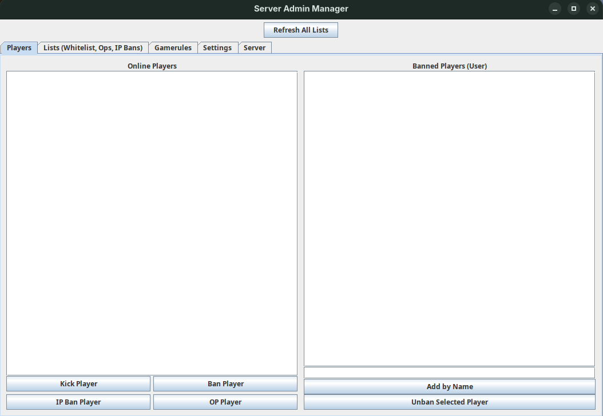
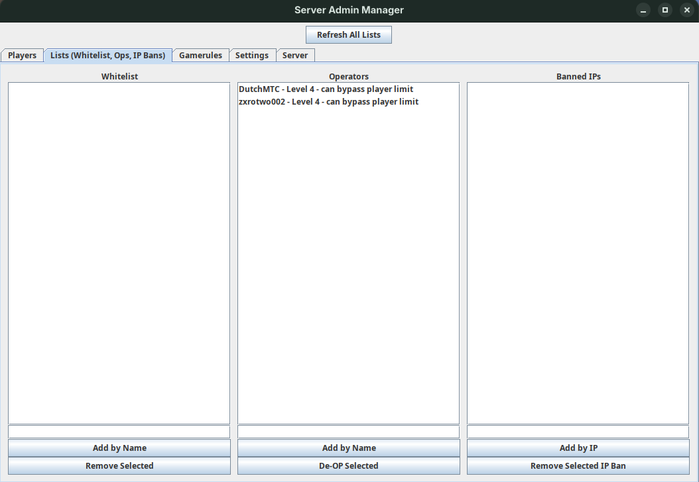
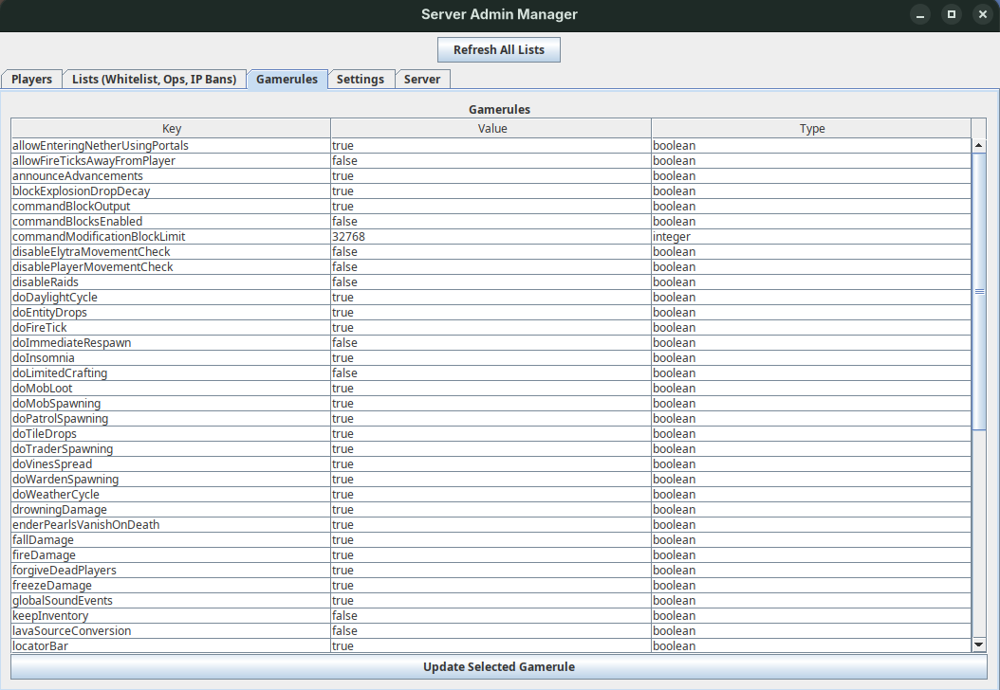
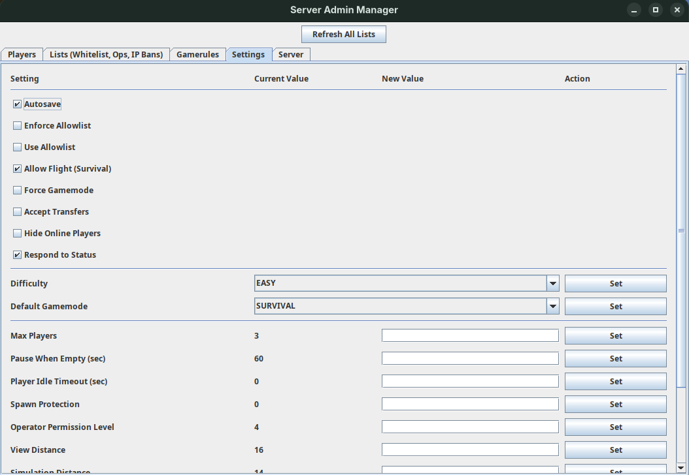
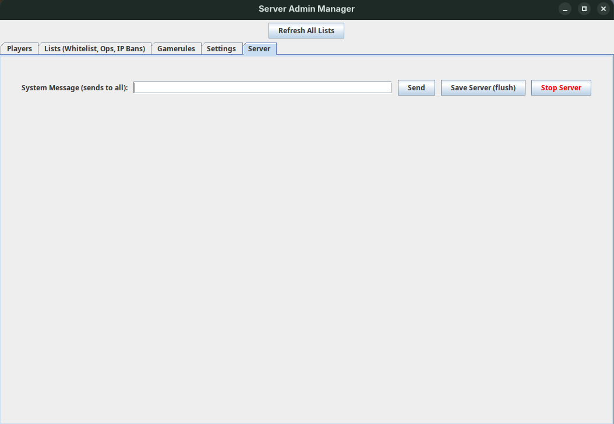

# Minecraft Server Admin Panel
A small Admin Panel using the new Minecraft Server Management Protocol.  
The backend code like json parsing methods and websocket requests is written by me. For the UI I let generative AI help me.  

## Usage
Under linux create the file ```~/.minecraftServerSecret``` and put the URL to the websocket server of the minecraft server into the first line.  
Put the secret into the second line.  

Example File `~/.minecraftServerSecret`:
```
wss://example.com:25585
ABCDEFGHIJKLMNOPQRSTUVWXYZ1234567890abcd
```

When starting the Admin Panel it will ask for the Websocket URL and the Secret but will automatically fill the fields with the first and second line of `~/.minecraftServerSecret` respectively.





